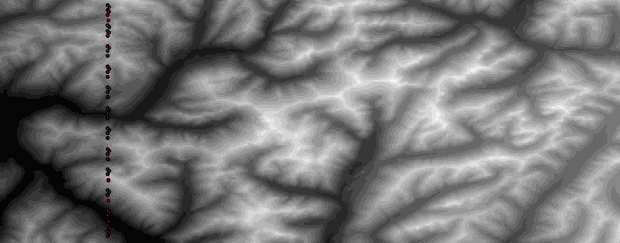

# BigAssTerrainSim

## Details about terrain Simulation

### Current Capabilities
- configurable number of agents that are randomly positioned
- agent movements occur in parallel on the gpu
- random agent movements are generated (change in speed+ heading) and fed into the simulation

### Next steps
- write a python wrapper so that agent movements can be sent in via python...currently i'm thinking to use ctypes but mostly because pybind11 confuses me
- expand the fidelity by enforcing traversibility rules, visibility+traversibility based on terrain using innersource capabilities
- must expand the testing; currently only testing the loading of the raster
- explore topography datasets to get more tiff files

# Docker 
```bash
sudo docker build -t bats:latest .
sudo docker run --gpus all -dit --mount type=bind,source="$(pwd)",target=/usr/src bats:latest
```

# Copernicus data; this is a great dataset but haven't completely figured it out
```text
key: 807QSJUD3SKJJ0PBY9H4
secret: N8qXCFofGiQdc0GU9SOZKOArgkCmzVsH75TJnsL4
aws configure
export AWS_ENDPOINT_URL=https://eodata.dataspace.copernicus.eu/
aws s3 ls s3://eodata/auxdata/CopDEM_COG/copernicus-dem-30m/Copernicus_DSM_COG_10_S90_00_W180_00_DEM/
```

# Formatting
```bash
sudo apt-get install clang-format
clang-format -style=Google -dump-config > .clang-format
find src include -iname "*.cpp" -o -iname "*.h" | xargs clang-format -i
```
sudo apt-get install clang-tidy
find src -name "*.cpp" | xargs -r -I{} clang-tidy {} -- -Iinclude


# Run Tests
## To get get gtest
```bash
mkdir -p external/gtest && cd external/gtest
git clone https://github.com/google/googletest.git
cd googletest
cmake -DBUILD_GMOCK=OFF -DBUILD_GTEST=ON .
make
```
## To build tests
```bash
mkdir -p build && cd build
cmake .. -DCMAKE_BUILD_TYPE=Debug
make
```
## To run tests
```bash
ctest --output-on-failure
```

# Documenting with doxygen
`doxygen -g Doxyfile`
This creates Doxyfile, the config file for generating documentation.

### Enable C++ Support in Doxyfile
Edit Doxyfile and modify:

```ini
EXTRACT_ALL            = YES
FILE_PATTERNS          = *.cpp *.h
GENERATE_HTML          = YES
GENERATE_LATEX         = NO
```

### Generate Documentation
```bash
doxygen Doxyfile
```
This creates an HTML documentation in html/. Open:

```bash
xdg-open html/index.html
```